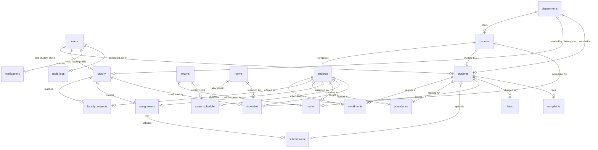

# Campus360 - Complete University Management System

Campus360 is a production-quality, responsive full-stack University Management System. It is designed to handle university-wide operations, from student enrollment and course management to department oversight by HODs, faculty-led attendance marking, academic grading, and student portal access.

---

## 1. Project Overview
Campus360 is built using the classical 3-tier architecture: React (frontend), Node.js/Express (backend), and MySQL (relational database). The system provides secure role-based access control (RBAC) to ensure confidentiality and integrity of university operations across different administration levels.

## 2. Problem Statement
Universities are complex systems with multiple stakeholders (Admins, Head of Departments, Faculty members, and Students). Managing departments, courses, timetables, attendance, grades, notices, and complaints through separate systems leads to data duplication, scheduling conflicts, communication gaps, and security risks. Campus360 provides a single, unified, secure platform with real-time audit logs and analytics to streamline academic workflows.

## 3. Features
* **Role-Based Portals**: Tailored interfaces for Admins, HODs, Faculty, and Students.
* **Academic Administration**: Manage departments, courses, subjects, rooms, and semesters.
* **Timetable Scheduler**: Conflict-free scheduling with automatic room, course, and faculty overlap checks.
* **Smart Attendance**: Session-by-session student attendance tracking with low attendance alerts.
* **Assignment Manager**: Handouts, deadlines, file attachments, and student submissions/grading.
* **Examinations & Grading**: Exam scheduler, room allocation, internal/midterm/practical/final marks entry with CGPA calculation.
* **Fee Record Tracker**: Transparent log of total, paid, and outstanding fee structures.
* **Notices & Notifications**: Target notices by department or user role with automated in-app notifications.
* **Complaints Portal**: Student feedback tracking from Open to In-Progress, Resolved, and Closed.
* **System Auditing**: Real-time logging of critical system operations for administrative accountability.

## 4. User Roles
The system enforces strict RBAC (Role-Based Access Control) with four distinct roles:
1. **ADMIN**: Full system control. Manages departments, courses, subjects, users, rooms, enrollments, timetables, exams, fees, and system-wide audits.
2. **HOD (Head of Department)**: Manages their assigned department. Moniters department faculty, students, academic analytics, results, and logs.
3. **FACULTY**: Academic manager. Views assigned subjects and students, records attendance, uploads materials, sets assignments, and grades submissions.
4. **STUDENT**: Personal portal. Tracks profile, enrolled courses, attendance status, marks, timetable, fees, notifications, and lodges/tracks complaints.

## 5. Tech Stack
* **Frontend**: React, Vite, React Router DOM, Axios, Recharts, Custom CSS (Sass/CSS variables style)
* **Backend**: Node.js, Express, JavaScript
* **Database**: MySQL (relational database)
* **Security & Auth**: JWT, bcryptjs, Helmet, Express Rate Limit, Express Validator, CORS

---

## 6. Architecture
Campus360 utilizes a decoupled client-server architecture:
```
Client (React App)
   │
   ▼ HTTP Requests / REST API
Server (Express.js)
   │
   ├── Middlewares (Auth, Role, Rate Limiter, Validations)
   ├── Controllers (Request routing & response handlers)
   ├── Services (Business logic & database transactions)
   └── Models (MySQL Parameterized SQL execution)
   │
   ▼
Database (MySQL Pool)
```

---

## 7. Folder Structure
```
Campus360/
├── database/
│   ├── schema.sql
│   └── seed.sql
├── backend/
│   ├── src/
│   │   ├── config/       # Database connection pool settings
│   │   ├── controllers/  # API request controllers
│   │   ├── docs/         # API documentation & ER diagrams
│   │   ├── middlewares/  # Authentication, validation, and security middlewares
│   │   ├── models/       # Database query models
│   │   ├── routes/       # API router index & modules
│   │   ├── seed/         # Demo data scripts
│   │   ├── services/     # Business logic layer
│   │   ├── uploads/      # User files (assignments, materials, profiles)
│   │   ├── utils/        # General helper scripts & error wrappers
│   │   ├── app.js        # Express middleware setup
│   │   ├── constants.js  # App constants and enums
│   │   └── index.js      # DB connect & HTTP listener
│   ├── .env.example
│   ├── .gitignore
│   └── package.json
└── frontend/
    ├── src/
    │   ├── assets/       # Styles, images, icons
    │   ├── components/   # Reusable UI elements (Button, Table, StatCard)
    │   ├── context/      # Auth & global context states
    │   ├── hooks/        # Custom react hooks
    │   ├── layouts/      # Dashboard layouts per role (AdminLayout, StudentLayout)
    │   ├── pages/        # Page views categorized by role
    │   ├── routes/       # Protected routes and config
    │   ├── services/     # Axios client wrappers for backend communication
    │   ├── utils/        # Formatting and helper utilities
    │   ├── App.jsx       # Component router routes
    │   └── main.jsx      # React index file
```

---

## 8. Database Schema
The database contains normalized relational tables structured with primary keys, foreign keys, indexes, and unique constraints. See [database/schema.sql](file:///c:/Users/JAINSI SINHA/OneDrive/Desktop/Campus360/database/schema.sql) for details.

---

## 9. ER Diagram
Below is the relational entity diagram representing the Campus360 relational structure:



---

## 10. API Documentation
The backend exposes logical REST API endpoints for all modules. Sub-routes are registered prefixing `/api`:
* **Auth**: `/api/auth` (Register, Login, Profile)
* **Admins/HODs**: `/api/students`, `/api/faculty`, `/api/departments`, `/api/courses`, `/api/subjects`, `/api/rooms`, `/api/audit-logs`
* **Academics**: `/api/enrollments`, `/api/attendance`, `/api/timetable`, `/api/exams`, `/api/exam-schedule`, `/api/marks`, `/api/results`
* **Tasks/Materials**: `/api/assignments`, `/api/submissions`, `/api/materials`
* **Utilities**: `/api/fees`, `/api/notices`, `/api/notifications`, `/api/complaints`, `/api/dashboard`, `/api/reports`

## 11. Authentication
* **Standard**: JWT (JSON Web Tokens) generated using the user ID, email, and role.
* **Verification**: Custom `auth` middleware intercepts requests, extracts the JWT from the `Authorization: Bearer <token>` header, decodes it, and appends the user object to `req.user`.
* **RBAC**: Middleware functions verify if `req.user.role` matches the route permissions (e.g., `authorize('ADMIN', 'HOD')`).

## 12. Environment Variables
To run Campus360, create a `.env` file in the `backend/` directory following `.env.example`:
```env
PORT=5000
DB_HOST=localhost
DB_PORT=3306
DB_USER=root
DB_PASSWORD=your_password
DB_NAME=campus360
JWT_SECRET=your_jwt_secret_token
CLIENT_URL=http://localhost:5173
```

## 13. Database Setup
1. Log in to your MySQL terminal or database client (e.g., Workbench).
2. Create the database: `CREATE DATABASE campus360;`.
3. Import the tables: `mysql -u root -p campus360 < database/schema.sql`.
4. (Optional) Run the seed file to generate sample users, courses, and timetables: `mysql -u root -p campus360 < database/seed.sql`.

## 14. Running Backend
1. Navigate to the backend directory:
   ```bash
   cd backend
   ```
2. Install dependencies:
   ```bash
   npm install
   ```
3. Start in development mode (using nodemon):
   ```bash
   npm run dev
   ```
4. Verify by checking `http://localhost:5000/api/health`.

## 15. Running Frontend
1. Navigate to the frontend directory:
   ```bash
   cd frontend
   ```
2. Install dependencies:
   ```bash
   npm install
   ```
3. Start the Vite development server:
   ```bash
   npm run dev
   ```
4. Open your browser at `http://localhost:5173`.

## 16. Seed Data
A comprehensive database seed script/SQL is provided inside `database/seed.sql`. It includes:
* **Admin**: 1 user
* **HODs**: 2 users representing Departments (e.g., Computer Science, Electrical Engineering)
* **Faculty**: 5 users assigned to various subjects
* **Students**: 20 users with enrolled departments, academic schedules, mock grades, and complaints
* **Other mock records**: Timetables, notices, mock fees, exam schedule.

## 17. Testing
All APIs can be tested using Postman. Security test cases include verifying role limits (e.g., students attempting to write to HOD/Admin routes, faculty editing grades for unassigned subjects, timetable overlap errors, and oversized attachment uploads).

## 18. Screenshots
*(To be populated in later versions after the front-end dashboard builds)*

## 19. Future Improvements
* **AI Integration**: AI-powered academic performance prediction, smart chatbot, and personalized recommendation systems may be added in a future version.
